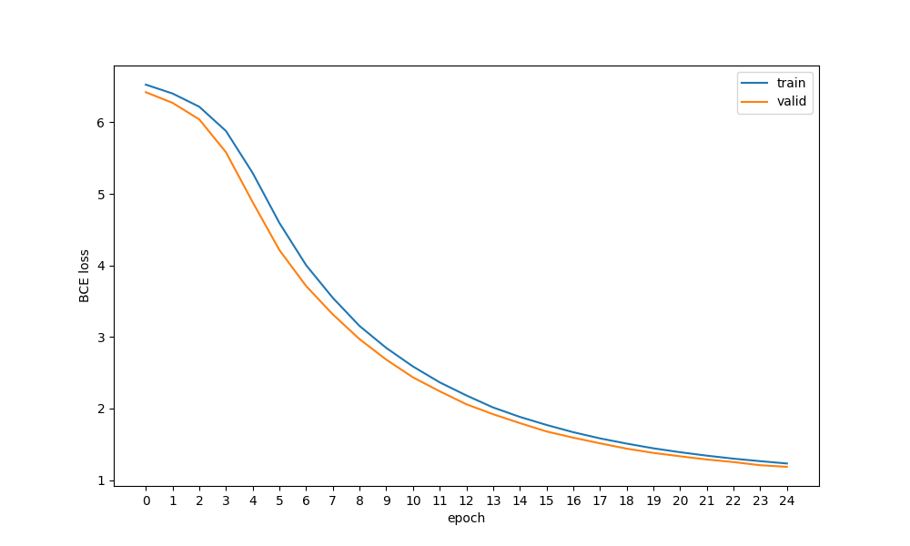

# pytorch_SASRec
SASRec implemented in pytorch and trained with Movielens-1m

Original Paper:[Self-Attentive Sequential Recommendation](https://arxiv.org/abs/1808.09781)

### Download Movielens-1m
```
1. chmod 755 download.sh 
2. ./download.sh
```

### Model training 
```
1. pyenv local 3.11
2. poetry install
3. poetry run python src/main.py 
```

### Results



log
```
Train [1 / 25] Loss : 123.99811458587646
Valid [1 / 25] Loss : 32.10240077972412
HitCount:17.  HitRate@10:0.014072847682119206.

Train [2 / 25] Loss : 121.64477634429932
Valid [2 / 25] Loss : 31.358295917510986
HitCount:18.  HitRate@10:0.014900662251655629.

Train [3 / 25] Loss : 118.13690519332886
Valid [3 / 25] Loss : 30.204675674438477
HitCount:18.  HitRate@10:0.014900662251655629.

Train [4 / 25] Loss : 111.69819355010986
Valid [4 / 25] Loss : 27.90813159942627
HitCount:26.  HitRate@10:0.02152317880794702.

Train [5 / 25] Loss : 100.54494142532349
Valid [5 / 25] Loss : 24.422787189483643
HitCount:26.  HitRate@10:0.02152317880794702.

Train [6 / 25] Loss : 87.29149580001831
Valid [6 / 25] Loss : 21.075927734375
HitCount:30.  HitRate@10:0.024834437086092714.

Train [7 / 25] Loss : 76.06868362426758
Valid [7 / 25] Loss : 18.562803983688354
HitCount:33.  HitRate@10:0.027317880794701987.

Train [8 / 25] Loss : 67.39660787582397
Valid [8 / 25] Loss : 16.578752040863037
HitCount:32.  HitRate@10:0.026490066225165563.

Train [9 / 25] Loss : 59.931649923324585
Valid [9 / 25] Loss : 14.85164761543274
HitCount:30.  HitRate@10:0.024834437086092714.

Train [10 / 25] Loss : 54.106123208999634
Valid [10 / 25] Loss : 13.420570611953735
HitCount:30.  HitRate@10:0.024834437086092714.

Train [11 / 25] Loss : 49.17696833610535
Valid [11 / 25] Loss : 12.181409120559692
HitCount:32.  HitRate@10:0.026490066225165563.

Train [12 / 25] Loss : 44.96484875679016
Valid [12 / 25] Loss : 11.208972930908203
HitCount:31.  HitRate@10:0.02566225165562914.

Train [13 / 25] Loss : 41.48410081863403
Valid [13 / 25] Loss : 10.300474166870117
HitCount:36.  HitRate@10:0.029801324503311258.

Train [14 / 25] Loss : 38.28985810279846
Valid [14 / 25] Loss : 9.605266094207764
HitCount:35.  HitRate@10:0.028973509933774833.

Train [15 / 25] Loss : 35.792067527770996
Valid [15 / 25] Loss : 8.98451817035675
HitCount:36.  HitRate@10:0.029801324503311258.

Train [16 / 25] Loss : 33.65150320529938
Valid [16 / 25] Loss : 8.400639653205872
HitCount:40.  HitRate@10:0.033112582781456956.

Train [17 / 25] Loss : 31.72524654865265
Valid [17 / 25] Loss : 7.966296911239624
HitCount:38.  HitRate@10:0.03145695364238411.

Train [18 / 25] Loss : 30.08719837665558
Valid [18 / 25] Loss : 7.572001218795776
HitCount:45.  HitRate@10:0.037251655629139076.

Train [19 / 25] Loss : 28.698294043540955
Valid [19 / 25] Loss : 7.1996999979019165
HitCount:54.  HitRate@10:0.04470198675496689.

Train [20 / 25] Loss : 27.446386456489563
Valid [20 / 25] Loss : 6.901871681213379
HitCount:58.  HitRate@10:0.048013245033112585.

Train [21 / 25] Loss : 26.409238815307617
Valid [21 / 25] Loss : 6.665367245674133
HitCount:55.  HitRate@10:0.04552980132450331.

Train [22 / 25] Loss : 25.497925877571106
Valid [22 / 25] Loss : 6.440584063529968
HitCount:62.  HitRate@10:0.05132450331125828.

Train [23 / 25] Loss : 24.699480772018433
Valid [23 / 25] Loss : 6.261878967285156
HitCount:62.  HitRate@10:0.05132450331125828.

Train [24 / 25] Loss : 24.033594250679016
Valid [24 / 25] Loss : 6.041158080101013
HitCount:62.  HitRate@10:0.05132450331125828.

Train [25 / 25] Loss : 23.418235898017883
Valid [25 / 25] Loss : 5.928778529167175
HitCount:67.  HitRate@10:0.055463576158940396.
```


